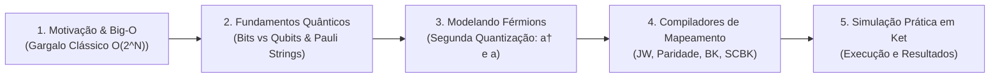

# Apresentação: Computação Quântica e Sistemas Fermiônicos: Fundamentos, Algoritmos e Simulação

> **Público-alvo:** Estudantes e Pesquisadores de Ciência da Computação / TI (sem pré-requisitos em física quântica avançada ou química profunda).  
> **Tom da apresentação:** Conceitual, algorítmico, visual e palatável — sem fórmulas matemáticas pesadas ou jargões inacessíveis.  
> **Duração estimada:** 50 a 60 minutos.  
> **Objetivo:** Mostrar como modelamos e simulamos elétrons e moléculas na computação quântica através de estruturas de dados (arrays, árvores, prefix sum), compiladores de mapeamento e código em Ket.

---

## 🎨 Galeria de Recursos Visuais e Imagens para os Slides

| Conceito / Slide | Prévia / Descrição | Link Direto da Imagem |
| :--- | :--- | :--- |
| **Richard Feynman (1982)** | Foto histórica de Feynman | [Feynman (Wikimedia)](https://upload.wikimedia.org/wikipedia/commons/1/1a/RichardFeynman-PaineMansionWoods1984_copyrightTamikoThiel_bw.jpg) |
| **Crescimento Exponencial ($2^N$)** | Curva de explosão combinatorial | [Exponential Growth (Wikimedia)](https://upload.wikimedia.org/wikipedia/commons/3/31/Exponential_growth.svg) |
| **Fixação de Nitrogênio (Enzima Nitrogenase)** | Estrutura catalítica FeMo-cofactor | [Nitrogenase (Wikimedia)](https://upload.wikimedia.org/wikipedia/commons/9/9b/Nitrogenase.png) |
| **Esfera de Bloch (Qubit)** | Representação visual de 1 Qubit | [Bloch Sphere (Wikimedia)](https://upload.wikimedia.org/wikipedia/commons/6/6b/Bloch_sphere.svg) |
| **Orbitais Atômicos / Eletrônicos** | Espaços onde elétrons residem | [Hydrogen Orbitals (Wikimedia)](https://upload.wikimedia.org/wikipedia/commons/5/53/Hydrogen_Density_Orbitals.png) |
| **Geometria Molecular ($H_2O$)** | Molécula e coordenadas 3D | [Water Molecule 3D (Wikimedia)](https://upload.wikimedia.org/wikipedia/commons/e/e0/Water_molecule_3D.svg) |
| **Árvore Binária / Fenwick (Bravyi-Kitaev)** | Estrutura em árvore balanceada | [Binary Tree Structure (Wikimedia)](https://upload.wikimedia.org/wikipedia/commons/f/f7/Binary_tree.svg) |
| **Circuito Quântico / Portas** | Esquema de circuito com registradores | [Quantum Circuit (Wikimedia)](https://upload.wikimedia.org/wikipedia/commons/2/22/Quantum_teleportation_circuit.svg) |

---

## 🗺️ Mapa Conceitual da Apresentação (Visão Geral)



---

# 📑 Estrutura Detalhada Slide a Slide

---

### ABERTURA

#### Slide 1: Capa Principal
* **Tipo:** Título / Abertura
* **Título:** Computação Quântica e Sistemas Fermiônicos
* **Subtítulo:** Da Teoria aos Algoritmos, Estruturas de Dados e Código Prático em Ket
* **Elementos Visuais:**
  * Layout escuro/moderno, com ilustração suave conectando uma molécula a um circuito quântico.
  * Nome do apresentador, instituição e data.
* **O que falar:**
  > *"Boa tarde a todos! Hoje vamos falar sobre uma das aplicações mais importantes da computação quântica: a simulação de sistemas moleculares e elétrons. Se você é da área de Ciência da Computação e nunca viu física quântica a fundo, fique tranquilo: nossa abordagem hoje será focada em complexidade de algoritmos, estruturas de dados, bits e programação."*

---

#### Slide 2: Roteiro da Apresentação (Agenda)
* **Tipo:** Sumário / Roteiro
* **Título:** O que vamos explorar hoje
* **Elementos Visuais:** 5 blocos visuais ou linha do tempo.
* **Tópicos no Slide:**
  1. **A Grande Motivação:** Feynman, complexidade e por que computadores clássicos sofrem.
  2. **Fundamentos da Computação Quântica:** Bits vs. Qubits e a tríade das Strings de Pauli.
  3. **Modelando Férmions:** Segunda quantização para programadores (criação e aniquilação).
  4. **Compiladores de Mapeamento:** Traduzindo férmions para qubits (Jordan-Wigner e otimizações).
  5. **Prática com Ket:** Executando circuitos e validando resultados.
* **O que falar:**
  > *"Nossa jornada tem cinco etapas: começamos com a motivação e a complexidade Big-O que desafia a computação clássica; depois vemos os blocos fundamentais de qubits e matrizes de Pauli; em seguida, entendemos como representar elétrons como dados; conhecemos os algoritmos de mapeamento que funcionam como compiladores; e, por fim, colocamos a mão na massa com código em Ket."*

---

### BLOCO 1: A Grande Motivação & A Complexidade Clássica (~10 min)

#### Slide 3: Divisor de Seção (Bloco 1)
* **Tipo:** Divisor de Seção
* **Título:** 1. A Grande Motivação
* **Subtítulo:** Feynman, Big-O e o Limite dos Supercomputadores Clássicos

---

#### Slide 4: O Nascimento da Ideia (Impacto Feynman)
* **Tipo:** Impacto Visual / Citação Histórica
* **Título:** A Origem da Computação Quântica
* **Elementos Visuais:**
  * Foto de destaque: [Richard Feynman (1982)](https://upload.wikimedia.org/wikipedia/commons/1/1a/RichardFeynman-PaineMansionWoods1984_copyrightTamikoThiel_bw.jpg)
  * Citação central:
    > *"A natureza não é clássica, caramba; e se você quer fazer uma simulação da natureza, é melhor torná-la quântica..."*  
    > — **Richard Feynman (1982)**
* **O que falar:**
  > *"Em 1982, o físico Richard Feynman fez uma observação simples e genial: tentar simular a física microscópica em computadores convencionais é ineficiente porque a natureza no nível quântico funciona com regras diferentes. Para simular a natureza de verdade, precisamos de um computador que opere segundo as mesmas leis da física quântica."*

---

#### Slide 5: A Barreira da Complexidade: Big-O e o Crescimento Exponencial
* **Tipo:** Conceito Computacional / Gráfico
* **Título:** O Gargalo Clássico: Complexidade $\mathcal{O}(2^N)$
* **Elementos Visuais:**
  * Gráfico da curva exponencial: [Exponential Growth](https://upload.wikimedia.org/wikipedia/commons/3/31/Exponential_growth.svg)
  * Tabela de crescimento de memória:
    * **10 orbitais:** $2^{10} = 1.024$ estados ($\sim$ KBs — cabe em qualquer relógio digital)
    * **30 orbitais:** $2^{30} \approx 10^9$ estados ($\sim$ GBs — cabe em um PC)
    * **50 orbitais:** $2^{50} \approx 10^{15}$ estados ($\sim$ Petabytes — supercomputador topo de linha)
    * **100 orbitais:** $2^{100}$ estados (mais estados do que átomos em todo o planeta Terra!)
* **Tópicos no Slide:**
  * **Explosão Combinatória:** Cada elétron adicionado dobra a quantidade de memória necessária.
  * **Limite Físico:** Não existe silício nem memória RAM no mundo para simular moléculas de tamanho médio com exatidão clássica.
* **O que falar:**
  > *"Em Ciência da Computação, conhecemos bem a diferença entre um algoritmo polinomial e um exponencial. Simular múltiplos elétrons interagindo tem complexidade espacial e temporal de Big-O de 2 elevado a N. A cada novo orbital ou elétron, o espaço de busca dobra. Com 50 posições já precisamos de petabytes; com 100 posições, ultrapassamos a capacidade de toda a matéria da Terra. É um gargalo matemático puro."*

---

#### Slide 6: Onde Essa Simulação Faz Diferença no Mundo Real?
* **Tipo:** Casos de Uso / Aplicações Reais
* **Título:** Por que Resolver Esse Problema Importa?
* **Elementos Visuais:**
  * Imagem da enzima: [Nitrogenase / FeMo-cofactor](https://upload.wikimedia.org/wikipedia/commons/9/9b/Nitrogenase.png)
  * 3 caixas de destaque: Fertilizantes, Baterias e Novos Medicamentos.
* **Tópicos no Slide:**
  * **Produção de Fertilizantes:** O processo industrial Haber-Bosch consome $\sim 2\%$ de toda a energia elétrica mundial gerando calor e pressão; bactérias fazem isso no solo à temperatura ambiente usando a enzima *nitrogenase*.
  * **Materiais e Baterias:** Simulação de novos materiais para retenção de carga mais durável e segura.
  * **Farmacologia:** Design de moléculas e fármacos sem depender apenas de tentativa e erro em laboratório.
* **O que falar:**
  > *"Por que isso é tão valioso? Porque destravar essa simulação resolve problemas industriais gigantescos. Um exemplo clássico é a produção de fertilizantes agrícolas, que hoje gasta cerca de 2% da eletricidade do mundo inteiro. Uma bactéria faz isso naturalmente no solo à temperatura ambiente com a enzima nitrogenase. Se conseguirmos simular exatamente como ela funciona em um computador quântico, podemos revolucionar a produção de alimentos e salvar bilhões em energia."*

---

### BLOCO 2: Fundamentos da Computação Quântica (~10 min)

#### Slide 7: Divisor de Seção (Bloco 2)
* **Tipo:** Divisor de Seção
* **Título:** 2. Fundamentos da Computação Quântica
* **Subtítulo:** Do Bit ao Qubit e a Linguagem das Strings de Pauli

---

#### Slide 8: A Unidade Básica: Do Bit ao Qubit
* **Tipo:** Conceito Intuitivo
* **Título:** Bits vs. Qubits
* **Elementos Visuais:**
  * Ilustração comparativa: Bit tradicional ($0$ ou $1$) $\times$ Esfera de Bloch ([Bloch Sphere](https://upload.wikimedia.org/wikipedia/commons/6/6b/Bloch_sphere.svg)).
* **Tópicos no Slide:**
  * **Bit Clássico:** Apenas um estado por vez ($0$ ou $1$ — como uma chave de luz).
  * **Qubit:** Pode estar em $|0\rangle$, em $|1\rangle$, ou em uma **superposição** dos dois estados simultaneamente.
  * **Registrador de $n$ Qubits:** Consegue representar simultaneamente $2^n$ combinações em uma única estrutura quântica.
* **O que falar:**
  > *"Enquanto o bit clássico é como um interruptor que só pode estar ligado ou desligado, o qubit pode existir em superposição — uma combinação contínua de 0 e 1 ao mesmo tempo. A grande vantagem é que um registrador de N qubits consegue carregar e processar todas as 2 elevado a N combinações em paralelo."*

---

#### Slide 9: As Ferramentas do Sistema: Strings de Pauli (I, X, Y, Z)
* **Tipo:** Linguagem e Operações
* **Título:** As Ferramentas Fundamentais: Matrizes e Strings de Pauli
* **Elementos Visuais:**
  * 4 cartões com as operações:
    * **$I$ (Identidade):** Não faz nada (mantém o estado).
    * **$X$ (Bit-Flip):** Inverte o bit ($0 \to 1$ e $1 \to 0$, similar ao NOT).
    * **$Z$ (Phase-Flip):** Sensor de sinal (muda a fase se o bit for 1).
    * **$Y$ (Bit + Phase):** Combinação de inversão com rotação de fase.
* **Para que servem as Strings de Pauli? (A Tríade):**
  1. **Codificar:** Traduzem o problema real (moléculas, energias, rotas) na linguagem do hardware quântico (o Hamiltoniano).
  2. **Manipular:** Funcionam como portas lógicas que giram, transformam e entrelaçam os qubits durante o algoritmo.
  3. **Interrogar:** Definem como medimos o registrador quântico para extrair a resposta final sem destruir a informação útil.
* **O que falar:**
  > *"Para operar os qubits, usamos o conjunto de Pauli: I, X, Y e Z. Pense nelas como a linguagem de montagem (assembly) da computação quântica. E elas cumprem três papéis essenciais: primeiro, servem para codificar o problema físico na máquina; segundo, são as instruções lógicas que manipulam os qubits; e terceiro, são as regras de leitura para interrogar o sistema e obter o resultado final."*

---

#### Slide 10: O Desafio da Natureza: Qubits vs. Férmions (Slide de Transição)
* **Tipo:** Problema / Transição
* **Título:** A Ponte: Por que Qubits Sozinhos não Entendem Elétrons Diretamente?
* **Elementos Visuais:**
  * Diagrama comparativo:
    * **Qubits:** Independentes e comutativos ($X_0 X_1 = X_1 X_0$ — a ordem não muda o sinal).
    * **Férmions (Elétrons):** Antissimétricos ($e_1 e_2 = - e_2 e_1$ — trocar a ordem inverte o sinal do universo!).
* **Tópicos no Slide:**
  * **O Comportamento dos Qubits:** Modificar o Qubit 0 não afeta o Qubit 1 automaticamente.
  * **A Regra dos Férmions:** Elétrons são partículas antissimétricas; trocar dois elétrons de lugar gera um sinal de menos ($-1$).
  * **O Paradoxo:** Nosso hardware quântico é feito de qubits (que comutam). Como ensinamos qubits a respeitarem a física dos elétrons (que anticomutam)?
* **O que falar:**
  > *"Aqui chegamos no ponto crucial: já temos qubits e matrizes de Pauli, mas elétrons na natureza têm uma regra muito peculiar: se você troca a posição de dois elétrons, a equação inteira ganha um sinal de menos. Qubits comuns em um processador não fazem isso por conta própria. Precisamos de uma forma de ensinar essa regra de troca de sinal aos nossos qubits. E é aí que entra a Segunda Quantização e os Algoritmos de Mapeamento!"*

---

### BLOCO 3: Modelando Férmions na Computação (~12 min)

#### Slide 11: Divisor de Seção (Bloco 3)
* **Tipo:** Divisor de Seção
* **Título:** 3. Modelando Férmions na Computação
* **Subtítulo:** Segunda Quantização Descomplicada: Bits de Ocupação e Operadores

---

#### Slide 12: O que é um Elétron para a Ciência da Computação?
* **Tipo:** Analogia Computacional
* **Título:** Da Química para a Memória: Vetores de Ocupação
* **Elementos Visuais:**
  * Array binário de orbitais: `[1, 0, 1, 1, 0, 0, 1, 0]` (com elétrons representados em caixas).
* **Tópicos no Slide:**
  * **Princípio de Exclusão de Pauli:** Dois elétrons não podem ocupar exatamente a mesma vaga/orbital.
  * **Representação Binária:** Cada orbital atômico vira uma posição de memória de 1 bit:
    * `0` = Orbital vazio
    * `1` = Orbital ocupado por um elétron
  * **Estado do Sistema:** Uma sequência de bits (bitstring) que indica onde estão todos os elétrons da molécula.
* **O que falar:**
  > *"Como um cientista da computação olha para uma molécula? Nós discretizamos o espaço em 'vagas' chamadas orbitais. Pelo Princípio de Exclusão de Pauli, cada vaga só pode ter 0 ou 1 elétron. Isso significa que uma molécula pode ser descrita simplesmente como um vetor binário de ocupação: 1 onde tem elétron, 0 onde está vazio. É uma estrutura de dados incrivelmente limpa!"*

---

#### Slide 13: Segunda Quantização: As Duas Operações Básicas ($a^\dagger$ e $a$)
* **Tipo:** Álgebra Operacional Intuitiva
* **Título:** Segunda Quantização: As Funções "Escrever" e "Apagar"
* **Elementos Visuais:**
  * Diagrama de caixa com setas de inserção e remoção:
* **Tópicos no Slide:**
  * **Criação ($a^\dagger_i$):** "Escreve" um elétron no orbital $i$ ($|0\rangle \to |1\rangle$).
    * *Regra de Exclusão:* Se já tiver $1$, tentar criar outro zera a operação (não é permitido colisão).
  * **Aniquilação ($a_i$):** "Apaga" o elétron do orbital $i$ ($|1\rangle \to |0\rangle$).
    * *Regra de Consistência:* Se já estiver vazio ($0$), apagar zera a operação.
  * **Mover Elétron (Hopping - $a^\dagger_i a_j$):** Apaga do orbital $j$ e escreve no orbital $i$.
* **O que falar:**
  > *"Para manipular esse vetor de bits, a Segunda Quantização define duas operações fundamentais: o operador de criação (a dagger), que escreve um elétron, e o operador de aniquilação (a), que apaga um elétron. Se você tenta escrever onde já tem elétron, o sistema anula a operação por colisão. E para mover um elétron do orbital 3 para o orbital 7, fazemos simplesmente: apaga do 3 e cria no 7. Toda a dinâmica molecular se resume a combinações dessas duas ações."*

---

#### Slide 14: O "Bug" da Física: A Fase de Troca (Sinal Negativo)
* **Tipo:** Desafio Algorítmico
* **Título:** O Efeito Colateral: O Sinal da Anticomutação
* **Elementos Visuais:**
  * Exemplo visual de contagem de ocupação:
    * Inserir no orbital 4: precisa contar quantos elétrons existem nos orbitais 0, 1, 2 e 3.
    * Se o número de elétrons anteriores for **ímpar** $\to$ adiciona um sinal $-1$.
    * Se for **par** $\to$ sinal $+1$.
* **Tópicos no Slide:**
  * A ordem em que elétrons são criados ou movidos altera o sinal global do estado.
  * **O Requisito:** Qualquer programa ou circuito que simule elétrons precisa rastrear a **paridade** dos elétrons anteriores para aplicar o sinal correto.
  * **A Solução:** Precisamos de um **Compilador de Mapeamento** que converta os operadores $a^\dagger$ e $a$ em combinações equivalentes de matrizes de Pauli ($X, Y, Z$).
* **O que falar:**
  > *"Onde mora a pegadinha? Toda vez que criamos ou movemos um elétron na posição K, a física quântica exige que a gente conte quantos elétrons existem antes da posição K. Se houver uma quantidade ímpar de elétrons antes, temos que multiplicar tudo por menos 1. Como fazer essa contagem e aplicação de sinal usando apenas circuitos quânticos? É exatamente isso que os Algoritmos de Mapeamento resolvem."*

---

### BLOCO 4: Compiladores de Mapeamento Fermiônico (~10 min)

#### Slide 15: Divisor de Seção (Bloco 4)
* **Tipo:** Divisor de Seção
* **Título:** 4. Compiladores de Mapeamento
* **Subtítulo:** Do Operador Fermiônico ao Hardware: Jordan-Wigner e Complexidade Big-O

---

#### Slide 16: Jordan-Wigner na Prática: A "Explosão" de Operadores e Complexidade $\mathcal{O}(N)$
* **Tipo:** Pipeline Visual & Complexidade Assintótica
* **Título:** Jordan-Wigner: Da Instrução Química às Pauli Strings
* **Fórmulas Fundamentais (Criação e Aniquilação):**
  * **Criar Elétron ($a_j^\dagger$):**
    $$a_j^\dagger = \left( \bigotimes_{k=0}^{j-1} Z_k \right) \otimes \left( \frac{X_j - i Y_j}{2} \right) \otimes \left( \bigotimes_{k=j+1}^{N-1} I_k \right)$$
  * **Apagar Elétron ($a_j$):**
    $$a_j = \left( \bigotimes_{k=0}^{j-1} Z_k \right) \otimes \left( \frac{X_j + i Y_j}{2} \right) \otimes \left( \bigotimes_{k=j+1}^{N-1} I_k \right)$$
* **Elementos Visuais:**
  * Diagrama de compilação com a fita de registradores e análise de overhead:
```
 [ Código de Alto Nível ]          [ Compilador ]               [ Instruções de Hardware ]
  (Linguagem da Química)           (Jordan-Wigner)                  (Strings de Pauli)

        a₃† a₇             ──►     TRADUÇÃO      ──►      ½ ( X₃ Z₄ Z₅ Z₆ X₇  +  Y₃ Z₄ Z₅ Z₆ Y₇ )
 (Move elétron do 7 para o 3)                                     └──┬──┘ └──┬──┘ └──┬──┘
                                                                     │      │      │
                                            ┌────────────────────────┘      │      └────────────────────────┐
                                            ▼                               ▼                               ▼
                                     Qubit 3: CRIA             Qubits 4, 5, 6: SINAL           Qubit 7: APAGA
                                    (Ação no destino)        (Portas Z contam paridade)       (Ação na origem)
```
* **Fórmula do Salto Molecular ($a_3^\dagger a_7$):**
  $$a_3^\dagger a_7 = \frac{1}{2} (\; \underbrace{X_3}_{\text{Criação}} \underbrace{Z_4 Z_5 Z_6}_{\text{Paridade}} \underbrace{X_7}_{\text{Aniquilação}} \;+\; \underbrace{Y_3}_{\text{Criação}} \underbrace{Z_4 Z_5 Z_6}_{\text{Paridade}} \underbrace{Y_7}_{\text{Aniquilação}} \;)$$
* **Tópicos no Slide (O Custo da Não-Localidade para a Computação):**
  * **Ação Local ($q_3$ e $q_7$):** Portas $X$ e $Y$ realizam a escrita e remoção do elétron.
  * **O Overhead do Sinal ($q_4, q_5, q_6$):** A fita de portas $Z$ rastreia a paridade dos elétrons anteriores para garantir a fase antissimétrica ($-1$).
  * **Análise de Complexidade Big-O:**
    * **Tamanho da String:** Cresce linearmente como $\mathcal{O}(N)$ (100 orbitais distantes = até 100 portas acopladas).
    * **Impacto no Circuito Total:** Moléculas reais têm $\mathcal{O}(N^4)$ termos de interação $\to$ total de **$\mathcal{O}(N^5)$ portas quânticas**!
* **O que falar:**
  > *"Pensem no Jordan-Wigner como o compilador do nosso código quântico: em alto nível, escrevemos uma ação simples como mover um elétron do orbital 7 para o 3. O compilador traduz isso em portas X e Y nas pontas para criar e apagar, mas insere uma cadeia de portas Z em todos os qubits intermediários (4, 5 e 6) para funcionar como sensores de sinal. Para a Ciência da Computação, isso introduz um custo assintótico de Big-O de N por termo. Em moléculas grandes, multiplicar esse tamanho linear pelos O(N^4) termos da química gera um circuito com O(N^5) portas, o que é um pesadelo de ruído para o hardware atual."*

---

#### Slide 17: Comparativo de Compiladores: Estruturas de Dados e Redução Assintótica
* **Tipo:** Síntese / Análise Comparativa de Algoritmos
* **Título:** Indo Além do Linear: Árvores de Fenwick $\mathcal{O}(\log N)$ e Simetrias
* **Elementos Visuais:** Tabela comparativa clara e contrastada.

| Compilador / Mapeamento | Estrutura de Dados Subjacente | Comprimento das Strings (Big-O) | Qubits Usados (Ex: 8 Orbitais) | Impacto Prático no Hardware |
| :--- | :--- | :---: | :---: | :--- |
| **Jordan-Wigner (JW)** | Array Linear | Linear $\mathcal{O}(N)$ | 8 qubits | Intuitivo, mas circuitos longos para termos distantes |
| **Paridade (Parity)** | *Prefix Sum* (Soma Acumulada) | Linear $\mathcal{O}(N)$ | 8 qubits | Paridade total instantânea no último qubit |
| **Bravyi-Kitaev (BK)** | **Árvore de Fenwick (BIT)** | **Logarítmico $\mathcal{O}(\log N)$** | 8 qubits | **Circuitos curtos:** menos portas, menos ruído |
| **SCBK (BK + Simetria)** | **Árvore + *Qubit Tapering*** | **Logarítmico $\mathcal{O}(\log N)$** | **6 qubits (Economiza 2!)** | **Redução de hardware:** elimina qubits redundantes |

* **Tópicos no Slide:**
  * **Da Lista para a Árvore:** Substituir o array linear do JW por uma Árvore de Fenwick (Bravyi-Kitaev) derruba o custo das instruções de linear $\mathcal{O}(N)$ para logarítmico $\mathcal{O}(\log N)$.
  * **Otimização por Simetria (Ket):** O compilador **SCBK** identifica constantes físicas de conservação de elétrons e remove qubits físicos inteiros do chip quântico.
* **O que falar:**
  > *"Como resolvemos o gargalo de O(N) do Jordan-Wigner? Usando estruturas de dados melhores! O Bravyi-Kitaev organiza os qubits em uma Árvore de Fenwick, reduzindo o comprimento das instruções de linear O(N) para logarítmico O(log N). E com o SCBK, que implementamos no Ket, vamos além: usamos simetrias físicas da molécula para eliminar qubits inteiros do circuito, rodando um sistema de 8 orbitais em apenas 6 qubits físicos."*

---

### BLOCO 5: Programação Prática em Ket & Conclusão (~10 min)

#### Slide 18: Divisor de Seção (Bloco 5)
* **Tipo:** Divisor de Seção
* **Título:** 5. Programação Quântica com Ket
* **Subtítulo:** Do Algoritmo ao Código Executável e Validação

---

#### Slide 19: O Stack de Software: Onde o Ket se Encaixa?
* **Tipo:** Arquitetura de Software
* **Título:** O Pipeline de Software Quântico
* **Elementos Visuais:**
  * Diagrama de camadas de software:
```
[1. Modelo Químico / Físico]    -> Coordenadas 3D e Orbitais
              │
[2. Compilador de Mapeamento]   -> Transforma em Pauli Strings (JW / BK / SCBK)
              │
[3. Ambiente de Programação]    -> Ket (Linguagem e Runtime Quântico)
              │
[4. Execução]                   -> Simulador de Alto Desempenho ou QPU Real
```
* **O que falar:**
  > *"Como tudo isso se integra na prática? Temos um stack em camadas: a química define as coordenadas e orbitais; o compilador de mapeamento converte as interações em strings de Pauli; e a linguagem Ket recebe essas instruções, monta os registradores quânticos e executa o circuito no hardware ou simulador."*

---

#### Slide 20: Código Prático em Ket: Férmions e Mapeamento
* **Tipo:** Demonstração de Código Real
* **Título:** Do Operador Fermiônico às Pauli Strings no Ket
* **Elementos Visuais:**
  * Bloco de código Python nativo do Ket com entrada e saída real:
```python
from ket import Process, CreateFermion, AnnihilateFermion, FermionSentence, jordan_wigner

# 1. Aloca os 4 qubits
p = Process()
q = p.alloc(4)

# 2. Define o operador de criação a†_2 e aniquilação a_2
a2_dag = FermionSentence({CreateFermion(2): 1.0})
a2_ann = FermionSentence({AnnihilateFermion(2): 1.0})

# 3. Compila para Pauli Strings com Jordan-Wigner
print("Criação a†_2:", jordan_wigner(a2_dag, q))
# Saída: 0.5 * Z(0) Z(1) X(2) - 0.5j * Z(0) Z(1) Y(2)

# 4. Salto molecular (Hopping a†_0 a_2 + a†_2 a_0)
salto = FermionSentence({CreateFermion(0) * AnnihilateFermion(2): 0.5, CreateFermion(2) * AnnihilateFermion(0): 0.5})
print("Salto JW:", jordan_wigner(salto, q))
# Saída: 0.25 * X(0) Z(1) X(2) + 0.25 * Y(0) Z(1) Y(2)
```
* **Tópicos no Slide:**
  * **Sintaxe Fermiônica Nativa:** O Ket permite escrever expressões moleculares ($a^\dagger, a$) diretamente em Python.
  * **Compilação Automática:** A função `jordan_wigner` converte a álgebra dos elétrons nas matrizes de Pauli correspondentes com suas fases exatas.
* **O que falar:**
  > *"Vejam como a implementação no Ket é expressiva e direta: criamos os operadores fermiônicos nativamente em Python — como a criação a†_2 ou o salto a†_0 a_2 — e a função jordan_wigner compila automaticamente a expressão inteira para Pauli Strings, inserindo a fita de sensores Z(0) Z(1) e as rotações X e Y exatas que rodam na QPU."*

---

#### Slide 21: Validação Científica Cruzada
* **Tipo:** Validação Experimental
* **Título:** Validação com Bibliotecas Globais
* **Elementos Visuais:**
  * Logos / Blocos de validação:
    * Mapeamentos JW, BK e SCBK validados contra **OpenFermion** (Google Quantum AI).
    * Mapeamento de Paridade validado contra **PennyLane** (Xanadu).
* **Tópicos no Slide:**
  * **Concordância Total:** 100% de equivalência matemática em coeficientes e operadores nos testes com 4 e 8 elétrons.
  * Garantia de que a implementação é robusta e segue o estado da arte internacional.
* **O que falar:**
  > *"Para comprovar que nossa cadeia algorítmica está correta, validamos nossos resultados contra as principais ferramentas do mundo: o OpenFermion da Google Quantum AI e o PennyLane da Xanadu. O resultado foi 100% de concordância em todos os operadores e coeficientes gerados."*

---

#### Slide 22: Três Mensagens Principais para Levar para Casa (Takeaways)
* **Tipo:** Conclusão / Síntese
* **Título:** Conclusões e Mensagens Principais
* **Elementos Visuais:**
  * 3 caixas de destaque numeradas:
    1. **A Simulação Molecular é a Grande Aplicação:** É a área com maior probabilidade de atingir vantagem quântica real a curto e médio prazo.
    2. **Estruturas de Dados Fazem a Diferença:** Escolher entre arrays lineares (JW), árvores (BK) ou redução de simetria (SCBK) define se o circuito cabe ou não no computador.
    3. **O Papel da Computação:** O avanço da computação quântica depende fortemente de desenvolvedores de software, compiladores e algoritmos eficientes.
* **O que falar:**
  > *"Para fechar nossa apresentação, três ideias principais: primeiro, simular elétrons é onde a computação quântica terá seu maior impacto prático inicial. Segundo, estruturas de dados inteligentes vindas da Ciência da Computação viabilizam rodar esses algoritmos em hardware real. E terceiro, a computação quântica precisa de cientistas da computação projetando bons compiladores e ferramentas de software como o Ket."*

---

#### Slide 23: Agradecimentos & Perguntas
* **Tipo:** Encerramento
* **Título:** Muito Obrigado!
* **Subtítulo:** Perguntas & Respostas
* **Elementos Visuais:**
  * Contato (E-mail, GitHub, LinkedIn).
  * Link para a documentação e código do ecossistema **Ket**.
  * Destaque: *"Dúvidas, perguntas ou comentários?"*
* **O que falar:**
  > *"Muito obrigado pela atenção de todos! Estou à disposição para responder dúvidas e bater um papo sobre o projeto."*
