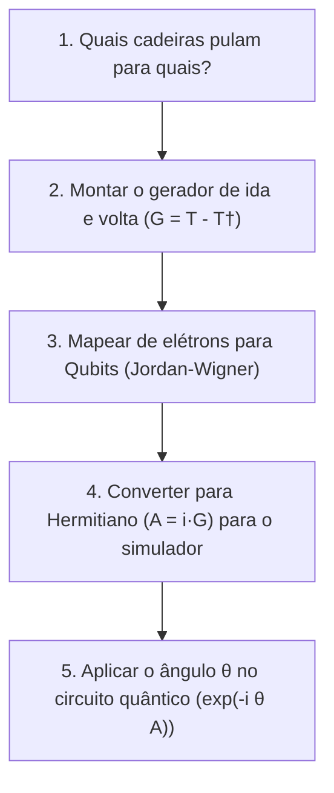

# Do Papel ao Código: Conectando a Teoria com o Ket e o Código da Colega

> **Objetivo:** Mostrar exatamente como cada conceito matemático que você acabou de aprender ($\theta$, $T$, $T^\dagger$, $G = T - T^\dagger$, Jordan-Wigner e $\exp(\theta G)$) se traduz em linhas de código reais no **Ket** (`src/ket/chem/uccsd.py`) e no código de referência (`uccsd_professor.txt`).

---

## 🗺️ O Mapa Geral da Conexão

Toda a teoria percorre um pipeline de **5 etapas exatas** que existem nos dois códigos:



---

## Passo a Passo: Comparando a Teoria com os Códigos

---

### ETAPA 1: Identificar os Pulos ($T$)
* **Teoria:** Quem são as cadeiras ocupadas (onde tem elétrons) e as virtuais (onde tem espaço)?
  * Para $H_2$: 2 elétrons e 4 orbitais.
  * Ocupadas: `[0, 1]`, Virtuais: `[2, 3]`.
  * Excitação dupla: $(0, 1) \to (2, 3)$.

| No Código da Colega (`uccsd_professor.txt`) | No Nosso Código Ket (`src/ket/chem/uccsd.py`) |
| :--- | :--- |
| Linha 350: `singles, doubles = qml.qchem.excitations(n_elec, n_so)` | Linha 67: `singles, doubles = generate_excitations(n_elec, n_so)` |
| Usa a biblioteca pronta do PennyLane | Função pura em Python com `itertools.combinations` respeitando conservação de spin |

---

### ETAPA 2: Montar a Ida Menos a Volta ($G = T - T^\dagger$)
* **Teoria:**
  * Ida ($T$): $a_3^\dagger a_2^\dagger a_1 a_0$ (tira de 0 e 1, põe em 2 e 3).
  * Volta ($T^\dagger$): $a_0^\dagger a_1^\dagger a_2 a_3$ (tira de 2 e 3, devolve para 0 e 1).
  * Gerador ($G$): $G = T - T^\dagger$.

| No Código da Colega (`uccsd_professor.txt`) | No Nosso Código Ket (`src/ket/chem/uccsd.py`) |
| :--- | :--- |
| Linhas 87–92:<br>```python<br>excitation = from_string("3+ 2+ 1- 0-")<br>generators.append(excitation - excitation.adjoint())<br>``` | Linhas 122–134:<br>```python<br>term_fwd = CreateFermion(3)*CreateFermion(2)*AnnihilateFermion(1)*AnnihilateFermion(0)<br>term_rev = CreateFermion(0)*CreateFermion(1)*AnnihilateFermion(2)*AnnihilateFermion(3)<br>generators.append(FermionSentence({term_fwd: 1.0, term_rev: -1.0}))<br>``` |

👉 **Veja:** É **exatamente a mesma física**! A colega escreveu como texto (`"3+ 2+ 1- 0-"`), enquanto no Ket usamos os objetos nativos `CreateFermion` e `AnnihilateFermion`.

---

### ETAPA 3: O Mapeamento de Jordan-Wigner ($G \longrightarrow \text{Matrizes de Pauli}$)
* **Teoria:** O computador quântico não opera com elétrons, ele opera com qubits ($X, Y, Z$).  
  O Jordan-Wigner traduz o operador fermiônico $G$ em uma soma de produtos de Pauli em 4 qubits:
  $$G \longrightarrow -\frac{i}{8} (X_0 Y_1 X_2 X_3 + Y_0 X_1 X_2 X_3 + \dots)$$

| No Código da Colega (`uccsd_professor.txt`) | No Nosso Código Ket (`src/ket/chem/uccsd.py`) |
| :--- | :--- |
| Linha 247: `mapped_generator = qml.jordan_wigner(fermionic_generator)` | Linha 192: `mapped_h = jordan_wigner(f_gen, qubits)` |

---

### ETAPA 4: Tornar Hermitiano ($A = i \cdot G$)
* **Teoria:** O operador $G$ mapeado tem aquele $-i$ na frente (é anti-hermitiano).  
  Para o simulador aplicar rotações $\exp(-i \theta A)$ com números reais, multiplicamos por $i$:
  $$A = i \cdot G \implies A = \frac{1}{8} (X_0 Y_1 X_2 X_3 + Y_0 X_1 X_2 X_3 + \dots) \quad \text{(coeficientes 100% reais!)}$$

| No Código da Colega (`uccsd_professor.txt`) | No Nosso Código Ket (`src/ket/chem/uccsd.py`) |
| :--- | :--- |
| Linha 116:<br>`hermitian_generator = qml.simplify(1j * qubit_generator)` | Linha 153:<br>`hermitian_op = 1j * qubit_generator` |

---

### ETAPA 5: Aplicar o Ângulo $\theta$ no Circuito Quântico ($\exp(-i \theta A)$)
* **Teoria:** Agora temos o ângulo $\theta$ que o otimizador (SciPy) escolheu e o operador $A = \sum_j c_j P_j$.  
  Queremos aplicar a porta $\exp(-i \theta c_j P_j)$.  
  Lembrando que uma rotação padrão é definida como $R(\phi) = \exp(-i \frac{\phi}{2} P)$, então o ângulo que passamos para a porta é:
  $$\phi = 2 \cdot c_j \cdot \theta$$

| No Código da Colega (`uccsd_professor.txt`) | No Nosso Código Ket (`src/ket/chem/uccsd.py`) |
| :--- | :--- |
| Linhas 519–521:<br>```python<br>angle = 2.0 * coefficient * theta<br>qml.PauliRot(angle, pauli_string, wires)<br>``` | Linhas 278–315:<br>```python<br>phi = 2.0 * coef * theta<br># Decompõe em portas físicas nativas:<br># 1. Mudança de base (H e RX)<br># 2. Escada de CNOTs<br># 3. RZ(phi) no qubit alvo<br># 4. Desfaz CNOTs e base<br>``` |

👉 **A Grande Diferença Aqui:**
- A colega usou a função pronta `qml.PauliRot` do PennyLane (uma caixa-preta).
- No **Ket**, nós implementamos a **decomposição física explícita em portas elementares ($H, RX, CNOT, RZ$)**, permitindo que o Ket execute isso nativamente no simulador KBW em C++/Rust com máxima eficiência e sem depender de nenhuma biblioteca externa!

---

## 🎯 Resumo da Ópera

| Conceito Teórico | No Código da Colega | No Nosso Código Ket |
| :--- | :--- | :--- |
| Pulos permitidos | `singles, doubles` | `singles, doubles` |
| $G = T - T^\dagger$ | `excitation - excitation.adjoint()` | `term_fwd - term_rev` |
| Fermions $\to$ Qubits | `qml.jordan_wigner` | `ket.chem.jordan_wigner` |
| Anti-hermitiano $\to$ Hermitiano | `1j * qubit_generator` | `1j * qubit_generator` |
| Aplicar $\theta$ no estado | `qml.PauliRot(2 * c * theta)` | `apply_uccsd(params, ansatz, q)` |
| Otimizador achando a energia | `scipy.optimize` / PennyLane | `scipy.optimize.minimize(..., method='COBYLA')` |

Percebeu como cada pedacinho da matemática é literalmente uma linha de código correspondente?
