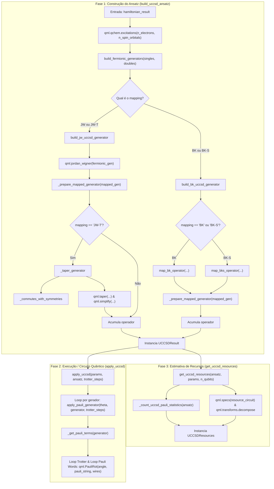
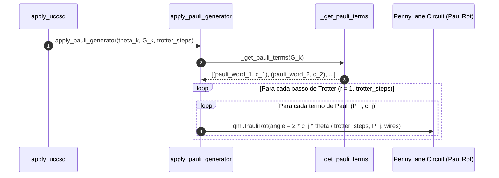

# Guia Didático e Passo a Passo: Implementação UCCSD (`uccsd_professor.txt`)

Este documento destrincha minuciosamente a arquitetura, a física/matemática e o fluxo de execução do código de UCCSD (**Unitary Coupled Cluster Singles and Doubles**) contido em [`uccsd_professor.txt`](file:///D:/inct/ket/uccsd_professor.txt).

---

## 1. Visão Geral e Intuição do UCCSD

O **UCCSD** é um dos ansatzes variacionais quânticos mais importantes para Química Quântica (algoritmo VQE). Ele prepara um estado quântico correlacionado a partir do estado de referência de Hartree-Fock $|\Phi_0\rangle$:

$$|\Psi(\vec{\theta})\rangle = \exp(\hat{T}(\vec{\theta}) - \hat{T}^\dagger(\vec{\theta})) |\Phi_0\rangle$$

Onde $\hat{G} = \hat{T} - \hat{T}^\dagger$ é o **operador de excitação anti-hermitiano** ($\hat{G}^\dagger = -\hat{G}$).
Como $\hat{G}$ é anti-hermitiano, $\exp(\hat{G})$ é um operador unitário perfeito ($U^\dagger U = I$), garantindo a conservação da norma do estado quântico.

O operador $\hat{T} = \hat{T}_1 + \hat{T}_2$ é composto por:
1. **Excitações Simples ($\hat{T}_1$):** Move 1 elétron de um orbital ocupado $p$ para um virtual $q$:
   $$\hat{T}_1 = \sum_{p, q} \theta_p^q \, a_q^\dagger a_p \implies \hat{G}_1 = \sum_{p, q} \theta_p^q (a_q^\dagger a_p - a_p^\dagger a_q)$$
2. **Excitações Duplas ($\hat{T}_2$):** Move 2 elétrons simultaneamente de orbitais ocupados $(p_1, p_2)$ para virtuais $(q_1, q_2)$:
   $$\hat{T}_2 = \sum_{p_1 < p_2, q_1 < q_2} \theta_{p_1 p_2}^{q_1 q_2} \, a_{q_2}^\dagger a_{q_1}^\dagger a_{p_2} a_{p_1} \implies \hat{G}_2 = \sum \theta (a_{q_2}^\dagger a_{q_1}^\dagger a_{p_2} a_{p_1} - a_{p_1}^\dagger a_{p_2}^\dagger a_{q_1} a_{q_2})$$

---

## 2. Diagrama da Arquitetura Geral e Fluxo de Chamadas

Abaixo está a ordem em que as funções são chamadas durante a execução:

---

## 3. Explicação Passo a Passo das Funções na Ordem de Execução

### Bloco A: Estruturas de Dados (`dataclasses`)

#### 1. `UCCSDResult` (Linhas 14–33)
Guarda o resultado da compilação do ansatz:
* `mapping`: Nome do mapeamento utilizado (`'JW'`, `'JW-T'`, `'BK'`, `'BK-S'`).
* `operators`: Tupla com todos os operadores hermitianos mapeados para qubits.
* `n_singles`, `n_doubles`: Quantidade de excitações simples e duplas geradas.
* `n_initial_generators`: Total inicial ($N_{\text{singles}} + N_{\text{doubles}}$).
* `n_symmetry_discarded`: Quantidade de geradores descartados por violarem simetrias $Z_2$.
* `n_zero_discarded`: Quantidade de geradores que simplificaram para zero (nulos).
* Implementa `__len__`, `__iter__` e `__getitem__` para se comportar como uma coleção de operadores.

#### 2. `UCCSDResources` (Linhas 35–53)
Armazena a contagem e análise de custo do circuito:
* Qubits, número de geradores, total de termos de Pauli, média de termos por gerador.
* Peso de Pauli médio e máximo (quantos qubits não-identidade cada string de Pauli atua).
* Contagem de portas decompiladas: CNOT, Hadamard, RX, RY, RZ, Total de portas e Profundidade do circuito (`depth`).

---

### Bloco B: Construção Fermiônica e Mapeamentos

#### 3. `build_fermionic_generators(singles, doubles)` (Linhas 56–94)
* **Objetivo:** Cria os operadores de excitação fermiônicos anti-hermitianos em 2ª quantização ($G = A - A^\dagger$).
* **Entrada:**
  * `singles`: Lista de tuplas `(ocupado, virtual)`.
  * `doubles`: Lista de tuplas `(ocupado_1, ocupado_2, virtual_1, virtual_2)`.
* **Como funciona:**
  1. Para cada par `(p, q)` em `singles`: monta $A = a_q^\dagger a_p$ e adiciona $A - A^\dagger = a_q^\dagger a_p - a_p^\dagger a_q$.
  2. Para cada quarteto `(p1, p2, q1, q2)` em `doubles`: monta $A = a_{q_2}^\dagger a_{q_1}^\dagger a_{p_2} a_{p_1}$ e adiciona $A - A^\dagger$.
* **Retorno:** Lista de operadores fermiônicos anti-hermitianos.

---

#### 4. `_prepare_mapped_generator(qubit_generator)` (Linhas 97–130)
* **Objetivo:** Converter o operador anti-hermitiano em um operador **Hermitiano** pronto para o circuito quântico.
* **Por que isso é necessário?**
  * Na mecânica quântica, a evolução unitária gerada por um operador anti-hermitiano $\hat{G}$ é $\exp(\hat{G})$.
  * Os simuladores quânticos (PennyLane, Ket, etc.) implementam rotações unitárias com geradores **hermitianos** $\hat{A}$ na forma:
    $$U(\theta) = \exp(-i \theta \hat{A})$$
  * Para que $\exp(-i \theta \hat{A}) = \exp(\theta \hat{G})$, definimos $\hat{A} = i \hat{G}$ (pois $-i \theta (i \hat{G}) = \theta \hat{G}$).
* **Passos:**
  1. Multiplica por $i$: `hermitian_generator = qml.simplify(1j * qubit_generator)`.
  2. Converte para `PauliSentence` e simplifica.
  3. Se o operador simplificar para zero (`len == 0`), retorna `None`.
  4. Mapeia os índices de wires para inteiros padrão.

---

#### 5. `_commutes_with_symmetries(operator, symmetries)` (Linhas 132–166)
* **Objetivo:** Verificar se um gerador comuta com todas as simetrias $Z_2$ encontradas na redução do Hamiltoniano.
* **Física:** Em reduções de simetria (Tapering), o espaço de Hilbert é projetado em um setor fixo de simetria (ex: paridade de spin e número de elétrons). Se um gerador de excitação não comutar com os geradores de simetria $[ \hat{A}, \hat{S}_k ] \ne 0$, ele misturaria setores de simetria diferentes e destruiria a validade da redução.
* **Passos:**
  1. Converte o operador e as simetrias em `PauliSentence`.
  2. Calcula o comutador $[A, S] = A S - S A$.
  3. Se algum comutador simplificado for diferente de zero, retorna `False`; se todos forem zero, retorna `True`.

---

#### 6. `_taper_generator(generator, hamiltonian_result)` (Linhas 168–213)
* **Objetivo:** Aplicar a redução de simetria $Z_2$ (tapering de Clifford) ao gerador individual.
* **Passos:**
  1. Se não houver simetrias no Hamiltoniano, retorna o próprio gerador.
  2. Se o gerador não comuta com as simetrias (`_commutes_with_symmetries`), descarta retornando `None`.
  3. Aplica a transformação de Clifford com `qml.taper(...)`.
  4. Simplifica a sentença de Pauli resultante; se for nula, retorna `None`.

---

#### 7. `build_jw_uccsd_generator(fermionic_generators, hamiltonian_result)` (Linhas 215–268)
* **Objetivo:** Mapear os geradores fermiônicos para qubits usando **Jordan-Wigner** (`JW` ou `JW-T`).
* **Passos:**
  1. Itera sobre cada gerador fermiônico.
  2. Aplica `qml.jordan_wigner(fermionic_generator)`.
  3. Converte para hermitiano com `_prepare_mapped_generator`.
  4. Se o mapeamento for `JW-T`, aplica `_taper_generator`.
  5. Acumula os operadores válidos e contabiliza descartes por zero ou por quebra de simetria.

---

#### 8. `build_bk_uccsd_generator(fermionic_generators, hamiltonian_result)` (Linhas 270–323)
* **Objetivo:** Mapear os geradores fermiônicos para qubits usando **Bravyi-Kitaev** (`BK`) ou **Symmetry-Conserving Bravyi-Kitaev** (`BK-S` / SCBK).
* **Passos:**
  1. Se for `BK`, usa `map_bk_operator`.
  2. Se for `BK-S`, usa `map_bks_operator` (passando o número de orbitais e elétrons para redução de 2 qubits).
  3. Prepara o operador com `_prepare_mapped_generator`.
  4. Retorna a lista de operadores mapeados.

---

#### 9. `build_uccsd_ansatz(hamiltonian_result, verbose)` (Linhas 325–389)
* **Função Principal da Fase 1:** Ponto de entrada para construir todo o ansatz.
* **Passos:**
  1. Chama `qml.qchem.excitations` para obter as combinações válidas de singles e doubles no espaço ativo.
  2. Chama `build_fermionic_generators` para criar os operadores de 2ª quantização.
  3. Roteia para `build_jw_uccsd_generator` ou `build_bk_uccsd_generator` conforme o mapeamento solicitado.
  4. Empacota tudo em um objeto `UCCSDResult`.

---

### Bloco C: Aplicação no Circuito Quântico

#### 10. `_get_pauli_terms(generator, tolerance)` (Linhas 426–463)
* **Objetivo:** Decompor um operador hermitiano $\hat{A}_k$ em uma lista de tuplas `(pauli_word, coeficiente_real)`.
* **Fórmula:**
  $$\hat{A}_k = \sum_{j} c_j \hat{P}_j$$
* Descarta termos desprezíveis ($|c_j| < 10^{-12}$) e termos de identidade $\hat{I}$ (que apenas gerariam fase global inobservável).
* Valida se todos os coeficientes são estritamente reais (garantia de hermiticidade).

---

#### 11. `apply_pauli_generator(theta, generator, trotter_steps)` (Linhas 465–523)
* **Objetivo:** Aplicar a exponencial de um gerador $\exp(-i \theta \hat{A}_k)$ no circuito quântico via fórmula de Trotter.
* **Matemática da Decomposição de Trotter:**
  Como os termos de Pauli $\hat{P}_j$ dentro do mesmo gerador nem sempre comutam entre si, aproximamos a exponencial pela decomposição de Trotter de 1ª ordem:
  $$\exp(-i \theta \sum_j c_j \hat{P}_j) \approx \left[ \prod_j \exp\left(-i \frac{c_j \theta}{r} \hat{P}_j\right) \right]^r$$
  onde $r = \text{trotter\_steps}$.
* **Relação com `qml.PauliRot`:**
  A porta `qml.PauliRot(phi, P)` do PennyLane implementa por definição:
  $$\text{PauliRot}(\phi, \hat{P}) = \exp\left(-i \frac{\phi}{2} \hat{P}\right)$$
  Igualando os expoentes:
  $$-i \frac{\phi}{2} = -i \frac{c_j \theta}{r} \implies \phi = \frac{2 c_j \theta}{r}$$
  É exatamente a fórmula na linha 519: `angle = (2.0 * coefficient * theta / trotter_steps)`.

---

#### 12. `apply_uccsd(params, ansatz, trotter_steps)` (Linhas 524–543)
* **Função Principal da Fase 2:**
* Itera sobre todos os parâmetros variacionais $\theta_k$ e os geradores $A_k$ do `UCCSDResult`, aplicando `apply_pauli_generator` em sequência para construir o ansatz variacional completo.

---

### Bloco D: Análise de Recursos e Estatísticas

#### 13. `_count_uccsd_pauli_statistics(ansatz)` (Linhas 391–424)
* Analisa todos os strings de Pauli gerados pelo ansatz e calcula métricas fundamentais:
  * Número total de termos de Pauli;
  * Média de termos por gerador;
  * Peso de Pauli médio ($\text{peso} = \text{número de operadores não-}I$ na palavra);
  * Peso de Pauli máximo.

#### 14. `get_uccsd_resources(ansatz, params, n_qubits, trotter_steps)` (Linhas 544–614)
* **Função Principal da Fase 3:**
* Monta um circuito de teste com `@qml.transforms.decompose` para as portas elementares $\{H, RX, RY, RZ, CNOT\}$.
* Extrai via `qml.specs` a contagem exata de cada tipo de porta quântica e a profundidade total do circuito.
* Retorna o objeto `UCCSDResources`.

---

## 4. Comparativo: O que o código faz vs. Como faremos Nativo no Ket

| Etapa | Código Colega (PennyLane/OpenFermion) | Como Faremos Nativo no Ket |
| :--- | :--- | :--- |
| **Geração de Excitações** | `qml.qchem.excitations` | Função pura em Python com itertools (`combinations` de ocupados $\to$ virtuais com mesmo spin) |
| **Operadores Fermiônicos** | `pennylane.fermi.from_string` | Classes nativas `ket.chem.Fermion` e `ket.chem.FermionSentence` |
| **Mapeamento Jordan-Wigner** | `qml.jordan_wigner` | `ket.chem.jordan_wigner` nativo |
| **Mapeamento Bravyi-Kitaev** | `map_bk_operator` (OpenFermion) | `ket.chem.bravyi_kitaev` nativo |
| **Redução SCBK (2 qubits)** | `map_bks_operator` (OpenFermion) | `ket.chem.symmetry_conserving_bravyi_kitaev` nativo |
| **Rot / Exponencial** | `qml.PauliRot` | Escada de CNOTs + $R_z$ nativa ou `expv` do simulador KBW |
| **Otimização Variacional** | `scipy.optimize` / JAX + PennyLane | `scipy.optimize` com execução no `ket.Process` / KBW |

---

## 5. Resumo da Lógica para Nossa Implementação no Ket

Para recriar essa lógica no Ket de forma limpa, elegante e sem nenhuma dependência externa:
1. **Módulo de Excitações:** Gerar tuplas $(p, q)$ e $(p_1, p_2, q_1, q_2)$ respeitando paridade de spin ($\alpha \to \alpha$, $\beta \to \beta$).
2. **Construção Fermiônica:** Cada excitação vira uma `FermionSentence` com termo direto $(+1)$ e adjunto $(-1)$.
3. **Mapeamento:** Passar a sentença fermiônica pelo mapeamento desejado (ex: `symmetry_conserving_bravyi_kitaev`).
4. **Filtro de Nulos:** Descartar termos onde o operador mapeado resulte vazio (`len(op.terms) == 0`).
5. **Conversão Hermitiana:** Multiplicar por $i$ ($1j \cdot G$) para produzir o gerador do ansatz.
6. **Circuito Variacional:** Uma função `uccsd_circuit(qubits, params, generators)` que itera aplicando as rotações de Pauli correspondentes.
