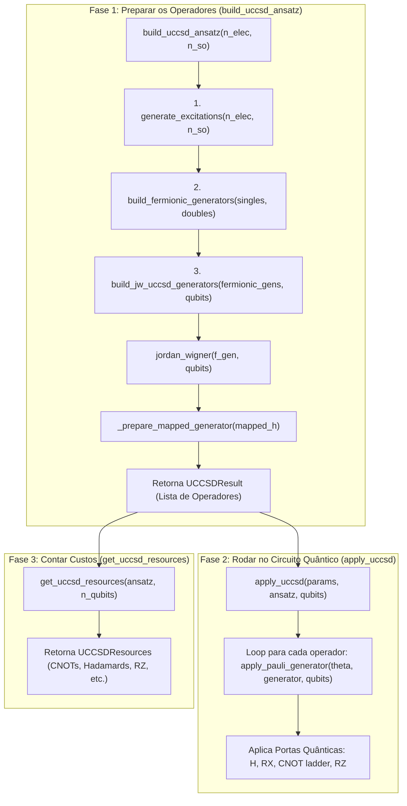

# Guia Linha a Linha do `uccsd.py`: Fluxo de Execução, Matemática e Código

> **Objetivo:** Destrinchar o arquivo [`src/ket/chem/uccsd.py`](file:///D:/inct/ket/src/ket/chem/uccsd.py) função por função, na exata ordem em que elas são chamadas, explicando a **matemática**, a **lógica computacional** e o **porquê** de cada linha existir.

---

## 🗺️ Mapa de Execução: Quem Chama Quem?

Quando o usuário quer usar o UCCSD, ele executa duas funções principais:



---

## Bloco 1: As Estruturas de Dados (`UCCSDResult` e `UCCSDResources`)

Antes de ver as funções, olhamos onde os dados são guardados (linhas 40–80):

### 1. `UCCSDResult` (Linhas 40–56)
```python
@dataclass(frozen=True)
class UCCSDResult:
    mapping: str
    operators: tuple[Hamiltonian, ...]
    n_singles: int
    n_doubles: int
    n_initial_generators: int
    n_symmetry_discarded: int = 0
    n_zero_discarded: int = 0
```
* **O que é?** É uma "caixa" (dataclass imutável) que guarda o resultado da compilação do ansatz.
* **O que tem dentro?**
  * `mapping`: Nome do mapeamento (`"JW"`).
  * `operators`: Tupla com os operadores de Pauli prontos para serem aplicados no circuito.
  * `n_singles`, `n_doubles`: Quantas excitações simples e duplas foram encontradas.
  * Métodos especiais `__len__`, `__iter__`, `__getitem__`: Permitem usar o objeto como uma lista normal em Python (`len(ansatz)`, `for op in ansatz:`, `ansatz[0]`).

---

## Bloco 2: O Passo a Passo da Fase 1 (Construção do Ansatz)

O ponto de entrada de tudo é a função **`build_uccsd_ansatz`** (Linhas 205–265).  
Vamos acompanhar o que acontece dentro dela:

---

### Passo 1.1: `generate_excitations` (Linhas 66–105)
A função `build_uccsd_ansatz` começa chamando:
```python
singles, doubles = generate_excitations(n_electrons, n_spin_orbitals)
```

#### 🧠 A Matemática por trás:
Temos $N_e$ elétrons e $N_{so}$ spin-orbitais.
* **Orbitais Ocupados:** $p \in \{0, 1, \dots, N_e - 1\}$.
* **Orbitais Virtuais (Vazios):** $q \in \{N_e, N_e + 1, \dots, N_{so} - 1\}$.
* **Regra do Spin ($\alpha$ e $\beta$):** 
  * Orbitais pares ($0, 2, 4, \dots$) são elétrons de spin-up ($\alpha$).
  * Orbitais ímpares ($1, 3, 5, \dots$) são elétrons de spin-down ($\beta$).
  * Um elétron só pode pular para outro orbital se **preservar o spin** ($\alpha \to \alpha$, $\beta \to \beta$). Em código, isso significa: `p % 2 == q % 2`.

#### 💻 O Código Explicado:
```python
# 1. Excitações Simples (1 elétron pula de p para q)
singles = []
for p in occupied:
    for q in virtual:
        if (q % 2) - (p % 2) == delta_sz:  # Mesmo spin!
            singles.append((p, q))

# 2. Excitações Duplas (2 elétrons pulam de (p1, p2) para (q1, q2))
doubles = []
for p1, p2 in combinations(occupied, 2):
    for q1, q2 in combinations(virtual, 2):
        spin_p = (p1 % 2) + (p2 % 2)
        spin_q = (q1 % 2) + (q2 % 2)
        if spin_q - spin_p == delta_sz:     # Soma dos spins conservada!
            doubles.append((p1, p2, q1, q2))
```
* **Exemplo para $H_2$ ($N_e=2, N_{so}=4$):**
  * `singles = [(0, 2), (1, 3)]` (o elétron $\alpha$ de 0 vai pra 2; o elétron $\beta$ de 1 vai pra 3).
  * `doubles = [(0, 1, 2, 3)]` (os elétrons 0 e 1 vão juntos para 2 e 3).

---

### Passo 1.2: `build_fermionic_generators` (Linhas 108–147)
Com as tuplas em mãos, `build_uccsd_ansatz` chama:
```python
fermionic_gens = build_fermionic_generators(singles, doubles)
```

#### 🧠 A Matemática por trás:
Para cada pulo, criamos o operador **anti-hermitiano de ida e volta ($G = T - T^\dagger$)**:
1. Para uma excitação simples $(p, q)$:
   $$T = a_q^\dagger a_p \quad \implies \quad G = a_q^\dagger a_p - a_p^\dagger a_q$$
2. Para uma excitação dupla $(p_1, p_2, q_1, q_2)$:
   $$T = a_{q_2}^\dagger a_{q_1}^\dagger a_{p_2} a_{p_1} \quad \implies \quad G = a_{q_2}^\dagger a_{q_1}^\dagger a_{p_2} a_{p_1} - a_{p_1}^\dagger a_{p_2}^\dagger a_{q_1} a_{q_2}$$

#### 💻 O Código Explicado:
```python
generators = []

# Monta G para cada single
for occupied, virtual in singles:
    term_fwd = CreateFermion(virtual) * AnnihilateFermion(occupied)      # Ida: a_q† a_p
    term_rev = CreateFermion(occupied) * AnnihilateFermion(virtual)      # Volta: a_p† a_q
    generators.append(FermionSentence({term_fwd: 1.0, term_rev: -1.0})) # G = Ida - Volta

# Monta G para cada double
for o1, o2, v1, v2 in doubles:
    term_fwd = (CreateFermion(v2) * CreateFermion(v1) * 
                AnnihilateFermion(o2) * AnnihilateFermion(o1))
    term_rev = (CreateFermion(o1) * CreateFermion(o2) * 
                AnnihilateFermion(v1) * AnnihilateFermion(v2))
    generators.append(FermionSentence({term_fwd: 1.0, term_rev: -1.0}))
```
* **Por que isso é anti-hermitiano?** Porque o coeficiente da ida é $+1.0$ e o da volta é $-1.0$. Se você tirar o adjunto ($^\dagger$), os termos invertem de lugar e ganham sinal de menos ($G^\dagger = -G$).

---

### Passo 1.3: `build_jw_uccsd_generators` (Linhas 180–203)
Agora os operadores ainda estão em "linguagem de elétrons" (férmions). Precisamos traduzir para "linguagem de qubits" (matrizes de Pauli $X, Y, Z$):

```python
def build_jw_uccsd_generators(fermionic_generators, qubits):
    operators = []
    for f_gen in fermionic_generators:
        # 1. Aplica a transformação de Jordan-Wigner nativa do Ket
        mapped_h = jordan_wigner(f_gen, qubits)
        
        # 2. Prepara o operador para virar Hermitiano com números reais
        prep_h = _prepare_mapped_generator(mapped_h)
        
        operators.append(prep_h)
    return operators, ...
```

---

### Passo 1.4: `_prepare_mapped_generator` (Linhas 150–178)
Esta função é um dos passos matemáticos mais importantes:

#### 🧠 A Matemática por trás:
Quando o Jordan-Wigner traduz $G$ (que é anti-hermitiano), ele resulta em operadores de Pauli com coeficientes puramente **imaginários** (com $i$, ex: $-0.125 i$).
Os simuladores quânticos precisam aplicar rotações da forma $\exp(-i \theta A)$, onde $A$ é um operador **Hermitiano** com coeficientes **reais**.

Fazemos a conversão:
$$A = i \cdot G$$
Multiplicar por $i$ ($1j$) cancela o $-i$ das matrizes de Pauli e transforma todos os coeficientes em **números reais**!

#### 💻 O Código Explicado:
```python
def _prepare_mapped_generator(qubit_generator, tolerance=1e-10):
    # Multiplica por i (1j) para tornar Hermitiano
    hermitian_op = 1j * qubit_generator

    valid_terms = []
    for term in hermitian_op.terms:
        # Pega a parte real do coeficiente (ex: 0.125)
        coef_real = term.coef.real
        
        # Ignora termos nulos ou identidades puras
        active_map = {q: p for q, p in term.map.items() if p != "I"}
        if abs(coef_real) > tolerance and len(active_map) > 0:
            valid_terms.append(Pauli(..., _map=active_map, _coef=coef_real))

    # Retorna o Hamiltonian do Ket limpo e com números reais
    return Hamiltonian(valid_terms, process=qubit_generator.ket_process)
```

---

## Bloco 3: O Passo a Passo da Fase 2 (Execução no Circuito Quântico)

Agora que temos o `UCCSDResult` com a lista de operadores hermitianos $A_k$, o usuário quer rodar o circuito variacional chamando **`apply_uccsd`** (Linhas 320–345).

---

### Passo 2.1: `apply_uccsd` (Linhas 320–345)
```python
def apply_uccsd(params, ansatz, qubits, trotter_steps=1):
    # Itera sobre cada parâmetro theta e cada operador A_k
    for theta, generator in zip(params, ansatz.operators):
        apply_pauli_generator(theta, generator, qubits, trotter_steps=trotter_steps)
```
* Se temos 3 operadores e passamos `params = [0.01, -0.02, 0.11]`, ela aplica cada um com seu respectivo $\theta$ chamando `apply_pauli_generator`.

---

### Passo 2.2: `apply_pauli_generator` (Linhas 268–318)
Esta é a função que **constrói as portas quânticas físicas** no registrador de qubits.

#### 🧠 A Matemática por trás (Trotterização e Rotações de Pauli):
Cada gerador $A_k$ é uma soma de strings de Pauli:
$$A_k = \sum_j c_j P_j \quad \text{(ex: } 0.125 \cdot X_0 Y_1 X_2 X_3 + \dots\text{)}$$

Queremos aplicar a evolução unitária:
$$U(\theta) = \exp(-i \theta A_k) \approx \prod_j \exp(-i \, c_j \theta \, P_j)$$

Na computação quântica, a porta de rotação em torno de um eixo $P$ é padronizada como:
$$R_P(\phi) = \exp\left(-i \frac{\phi}{2} P\right)$$

Igualando os expoentes:
$$-i \frac{\phi}{2} P = -i (c_j \theta) P \implies \mathbf{\phi = 2 \cdot c_j \cdot \theta}$$

#### 💻 Como o Código Transforma uma String de Pauli em Portas:
Vamos acompanhar linha a linha dentro de `apply_pauli_generator`:

```python
# 1. Calcula o ângulo phi da porta
phi = 2.0 * coef * theta / trotter_steps

# 2. Identifica quais qubits participam da string de Pauli (ex: X no qubit 0, Y no 1, Z no 2)
sorted_ops = sorted(active_map.items(), key=lambda item: item[0])
active_qubits = [qubits[q_idx] for q_idx, _ in sorted_ops]

# CASO 1: String de 1 qubit só (ex: Z_0)
if len(active_qubits) == 1:
    if pauli_char == "X": ket.RX(phi, target_q)
    elif pauli_char == "Y": ket.RY(phi, target_q)
    elif pauli_char == "Z": ket.RZ(phi, target_q)

# CASO 2: String multi-qubit (ex: X_0 Z_1 Y_2)
else:
    # Passo A: Mudança de base para Z
    # - Se for X, aplicamos Hadamard (H) porque H X H = Z
    # - Se for Y, aplicamos RX(-π/2) porque RX(-π/2) Y RX(π/2) = Z
    for q_idx, pauli_char in sorted_ops:
        if pauli_char == "X": ket.H(qubits[q_idx])
        elif pauli_char == "Y": ket.RX(-pi / 2, qubits[q_idx])

    # Passo B: Escada de CNOTs (calcula a paridade dos qubits até o último)
    for i in range(len(active_qubits) - 1):
        ket.CNOT(active_qubits[i], active_qubits[i + 1])

    # Passo C: Rotação Z no último qubit com o ângulo phi
    ket.RZ(phi, active_qubits[-1])

    # Passo D: Desfaz a escada de CNOTs (ordem inversa)
    for i in reversed(range(len(active_qubits) - 1)):
        ket.CNOT(active_qubits[i], active_qubits[i + 1])

    # Passo E: Desfaz a mudança de base
    for q_idx, pauli_char in sorted_ops:
        if pauli_char == "X": ket.H(qubits[q_idx])
        elif pauli_char == "Y": ket.RX(pi / 2, qubits[q_idx])
```

---

## Bloco 4: A Fase 3 (Contagem de Recursos: `get_uccsd_resources`)

A função **`get_uccsd_resources`** (Linhas 350–435) analisa todos os operadores do `UCCSDResult` e calcula o custo de hardware:
* Para cada string de Pauli de peso $W$ (que atua em $W$ qubits):
  * **CNOTs:** $2 \times (W - 1)$ portas.
  * **Hadamards:** $2 \times (\text{quantidade de } X)$.
  * **RX ($\pm\pi/2$):** $2 \times (\text{quantidade de } Y)$.
  * **RZ:** $1$ porta por termo de Pauli.
* Ela soma tudo e retorna a dataclass `UCCSDResources` com o total de portas e estatísticas de complexidade do circuito.

---

## 🎯 Resumo da Viagem dos Dados

1. `build_uccsd_ansatz(2, 4)`
   $\to$ Chama `generate_excitations` $\implies$ acha os pares/quartetos de orbitais.
   $\to$ Chama `build_fermionic_generators` $\implies$ monta $G = T - T^\dagger$ com `CreateFermion` e `AnnihilateFermion`.
   $\to$ Chama `build_jw_uccsd_generators` $\implies$ faz o Jordan-Wigner e multiplica por $1j$ em `_prepare_mapped_generator`.
   $\to$ Retorna o objeto `UCCSDResult`.

2. `apply_uccsd(params, ansatz, q)`
   $\to$ Chama `apply_pauli_generator` para cada $(\theta_k, A_k)$.
   $\to$ Converte a string de Pauli em portas físicas ($H, RX, \text{CNOTs}, RZ$).
   $\to$ O estado no simulador quântico é girado para $|\Psi(\vec{\theta})\rangle$!
