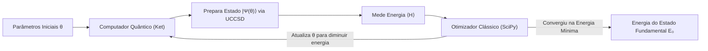
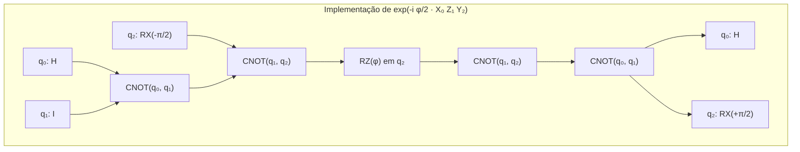

# Relatório Didático & Comparativo: UCCSD no Ket vs. Código de Referência (PennyLane)

> **Público-alvo:** Estudantes de Ciência da Computação / Engenharia de Software iniciando em Computação Quântica e Química Quântica.  
> **Objetivo:** Explicar a teoria, as equações matemáticas, a intuição física e comparar a implementação nativa no **Ket** (`src/ket/chem/uccsd.py`) com o código de referência (`uccsd_professor.txt`).

---

## 1. Intuição e Fundamentos: O que é o UCCSD?

### 1.1 O Problema da Química Quântica
Na química quântica, nosso objetivo principal é descobrir o **estado fundamental** (a configuração de menor energia) de uma molécula:

$$\hat{H} |\Psi\rangle = E_0 |\Psi\rangle$$

Em computadores clássicos, resolver isso exatamente (chamado de *Full Configuration Interaction* ou FCI) exige uma quantidade de memória que cresce **exponencialmente** com o número de elétrons e orbitais ($O(2^N)$). Para moléculas médias, o universo não teria átomos suficientes para construir a memória RAM necessária.

### 1.2 O Algoritmo VQE (Variational Quantum Eigensolver)
O VQE é um algoritmo híbrido quântico-clássico:
1. **O Computador Quântico (Ket):** Prepara um estado quântico parametrizado $|\Psi(\vec{\theta})\rangle$ através de um circuito quântico (chamado de **ansatz**) e calcula o valor esperado da energia $\langle \hat{H} \rangle = \langle \Psi(\vec{\theta}) | \hat{H} | \Psi(\vec{\theta}) \rangle$.
2. **O Otimizador Clássico (ex: SciPy):** Ajusta os ângulos $\vec{\theta}$ para minimizar a energia, até encontrar a energia mínima $E_0$ garantida pelo **Princípio Variacional** ($E(\vec{\theta}) \ge E_0$).



---

## 2. As Equações Matemáticas Explicadas Passo a Passo

### 2.1 Segunda Quantização: Operadores de Criação e Aniquilação
Representamos orbitais atômicos/moleculares como posições onde elétrons podem estar:
* $a_p^\dagger$: **Cria** um elétron no orbital $p$.
* $a_p$: **Destrói** (aniquila) um elétron no orbital $p$.

Os orbitais são divididos em:
* **Ocupados ($p, p_1, p_2$):** Onde os elétrons já estão no estado inicial de Hartree-Fock $|\Phi_0\rangle$ (orbitais $0, \dots, N_e - 1$).
* **Virtuais ($q, q_1, q_2$):** Orbitais vazios de maior energia para onde os elétrons podem "pular" (orbitais $N_e, \dots, N_{\text{orbitais}} - 1$).

---

### 2.2 O Operador de Excitação $T$ e o Ansatz UCCSD
No Coupled Cluster (CC), promovemos elétrons de orbitais ocupados para virtuais:
1. **Excitação Simples ($T_1$):** Move 1 elétron ($p \to q$):
   $$T_1 = \sum_{p, q} \theta_p^q \, a_q^\dagger a_p$$
2. **Excitação Dupla ($T_2$):** Move 2 elétrons simultaneamente ($(p_1, p_2) \to (q_1, q_2)$):
   $$T_2 = \sum_{p_1 < p_2, q_1 < q_2} \theta_{p_1 p_2}^{q_1 q_2} \, a_{q_2}^\dagger a_{q_1}^\dagger a_{p_2} a_{p_1}$$

---

### 2.3 Por que precisamos de $G = T - T^\dagger$ (Anti-Hermiticidade)?
Em computação quântica, qualquer porta quântica deve ser uma **matriz unitária** ($U^\dagger U = I$), para que as probabilidades somem sempre $100\%$ ($1.0$).
* O operador $T$ clássico **não** é unitário quando exponenciado.
* Mas se subtrairmos o seu adjunto hermitiano $T^\dagger$, formamos o gerador:
  $$G = T - T^\dagger$$
* Observe que $G^\dagger = (T - T^\dagger)^\dagger = T^\dagger - T = -G$. Isso significa que $G$ é **anti-hermitiano**!
* A exponencial de um operador anti-hermitiano $U = \exp(G)$ é **estritamente unitária**!

---

### 2.4 Por que transformamos $A = iG$ (Hermitiano)?
Na física quântica e nos simuladores (como o Ket), as rotações são parametrizadas por geradores **hermitianos** com números reais na forma:
$$U(\theta) = \exp(-i \theta A)$$

Para que $\exp(-i \theta A) = \exp(\theta G)$, basta fazermos:
$$-i \theta A = \theta G \implies A = i G$$
Assim, $A$ se torna um operador hermitiano ($A^\dagger = A$), cujas componentes de Pauli possuem **coeficientes 100% reais**!

---

### 2.5 A Transformação de Jordan-Wigner (JW)
Elétrons são férmions e obedecem ao Princípio de Exclusão de Pauli (se você troca dois elétrons de lugar, a função de onda ganha um sinal de $-1$). Qubits, por outro lado, são distinguíveis.

O mapeamento de **Jordan-Wigner** traduz operadores fermiônicos para matrizes de Pauli ($X, Y, Z$) em qubits:
$$a_j^\dagger \longrightarrow \left( \prod_{k=0}^{j-1} Z_k \right) \left( \frac{X_j - i Y_j}{2} \right)$$
$$a_j \longrightarrow \left( \prod_{k=0}^{j-1} Z_k \right) \left( \frac{X_j + i Y_j}{2} \right)$$

* A string de $Z$ ($Z_0 Z_1 \dots Z_{j-1}$) serve exatamente para controlar a fase antissimétrica dos férmions!

---

### 2.6 A Fórmula de Trotter e o Circuito Quântico
Após o mapeamento, cada gerador $A_k$ se transforma em uma soma de produtos de Pauli (strings de Pauli):
$$A_k = \sum_{j} c_j P_j \quad \text{(onde } P_j \text{ é algo como } X_0 Z_1 Y_2\text{)}$$

Como matrizes de Pauli diferentes nem sempre comutam ($P_1 P_2 \ne P_2 P_1$), usamos a **Aproximação de Trotter** de 1ª ordem para implementar a exponencial:
$$\exp\left(-i \theta \sum_j c_j P_j\right) \approx \left[ \prod_j \exp\left(-i \frac{c_j \theta}{r} P_j\right) \right]^r$$
onde $r$ é o número de passos de Trotter (`trotter_steps`).

#### Como uma string de Pauli vira portas quânticas?
Para aplicar $\exp(-i \frac{\phi}{2} P_j)$ onde $\phi = \frac{2 c_j \theta}{r}$:
1. **Mudança de base para Z:**
   - Se o operador no qubit for $X$: aplicamos a porta Hadamard $H$ (pois $H X H = Z$).
   - Se o operador no qubit for $Y$: aplicamos rotação $RX(-\pi/2)$ (pois $R_x(-\pi/2) Y R_x(\pi/2) = Z$).
   - Se for $Z$: não precisa fazer nada.
2. **Escada de CNOTs (Entanglement Ladder):**
   - Aplica uma sequência de portas CNOT encadeadas até o último qubit ativo para calcular a paridade conjunta.
3. **Rotação $R_Z(\phi)$:**
   - Aplica a porta $RZ(\phi)$ no último qubit.
   - Lembre-se: em computação quântica, $RZ(\phi) = \exp(-i \frac{\phi}{2} Z)$.
4. **Desfaz a escada de CNOTs:**
   - Aplica as CNOTs na ordem inversa.
5. **Desfaz a mudança de base:**
   - Aplica $H$ para quem era $X$, e $RX(+\pi/2)$ para quem era $Y$.



---

## 3. Comparação Lado a Lado: Código Deles vs. Nosso Código Ket

Abaixo está o comparativo detalhado de cada módulo e decisão de engenharia de software:

| Funcionalidade | Código Colega (`uccsd_professor.txt`) | Nossa Implementação Nativa (`src/ket/chem/uccsd.py`) | Por que a nossa abordagem é melhor no Ket? |
| :--- | :--- | :--- | :--- |
| **Framework Base** | PennyLane (`qml`) + OpenFermion | **Ket Nativo** (`ket.chem`, `ket.expv`, `ket.gates`) | **Zero dependências externas**; execução direta no simulador KBW em C++/Rust. |
| **Geração de Excitações** | `qml.qchem.excitations` (PennyLane) | `generate_excitations(n_elec, n_so)` (Python puro) | Implementação limpa e didática com conservação de spin ($\Delta S_z = 0$) usando `itertools.combinations`. |
| **Operadores Fermiônicos** | `pennylane.fermi.from_string("3+ 2+ 1- 0-")` | `CreateFermion` / `AnnihilateFermion` / `FermionSentence` | Usa a álgebra fermiônica nativa do Ket, tipada e orientada a objetos. |
| **Mapeamento JW** | `qml.jordan_wigner` | `ket.chem.jordan_wigner(f_gen, qubits)` | Mapeia diretamente para a estrutura `Hamiltonian` e `Pauli` do Ket. |
| **Preparação Hermitiana** | `_prepare_mapped_generator` com `qml.pauli.pauli_sentence` | `_prepare_mapped_generator` multiplicando $1j \cdot G$ e filtrando `term.map` | Conversão direta para instâncias de `Pauli` e `Hamiltonian` com coeficientes estritamente reais. |
| **Estrutura de Resultados** | Dataclass `UCCSDResult` com tupla de operações PennyLane | Dataclass `UCCSDResult` com tupla de `Hamiltonian` do Ket | Mantivemos a mesma interface padronizada, compatível com `len()`, indexação `[]` e iteração `for`. |
| **Aplicação no Circuito** | `qml.PauliRot(angle, pauli_str, wires)` | `apply_pauli_generator` e `apply_uccsd` com portas nativas (`H`, `RX`, `RZ`, `CNOT`) | O código decompõe explicitamente o circuito em portas fundamentais de 1 e 2 qubits, permitindo execução física em qualquer backend. |
| **Estimativa de Recursos** | `qml.specs` e `qml.transforms.decompose` | `get_uccsd_resources(ansatz, n_qubits)` | Análise analítica exata e instantânea de portas ($CNOT, H, RX, RY, RZ$) sem overhead de compilação. |

---

## 4. Comparativo de Código Linha a Linha

### 4.1 Geração de Operadores Fermiônicos

**Código Deles (PennyLane):**
```python
def build_fermionic_generators(singles, doubles):
    generators = []
    for occupied, virtual in singles:
        excitation = from_string(f"{virtual}+ {occupied}-")
        generators.append(excitation - excitation.adjoint())
    for o1, o2, v1, v2 in doubles:
        excitation = from_string(f"{v2}+ {v1}+ {o2}- {o1}-")
        generators.append(excitation - excitation.adjoint())
    return generators
```

**Nosso Código no Ket:**
```python
def build_fermionic_generators(singles, doubles):
    generators = []
    for occupied, virtual in singles:
        term_fwd = CreateFermion(virtual) * AnnihilateFermion(occupied)
        term_rev = CreateFermion(occupied) * AnnihilateFermion(virtual)
        generators.append(FermionSentence({term_fwd: 1.0, term_rev: -1.0}))
        
    for o1, o2, v1, v2 in doubles:
        term_fwd = CreateFermion(v2) * CreateFermion(v1) * AnnihilateFermion(o2) * AnnihilateFermion(o1)
        term_rev = CreateFermion(o1) * CreateFermion(o2) * AnnihilateFermion(v1) * AnnihilateFermion(v2)
        generators.append(FermionSentence({term_fwd: 1.0, term_rev: -1.0}))
    return generators
```

---

### 4.2 Síntese do Circuito Quântico

**Código Deles (PennyLane):**
```python
def apply_pauli_generator(theta, generator, trotter_steps):
    pauli_terms = _get_pauli_terms(generator)
    for _ in range(trotter_steps):
        for pauli_word, coefficient in pauli_terms:
            term_wires = list(pauli_word.keys())
            pauli_string = "".join(pauli_word[wire] for wire in term_wires)
            angle = (2.0 * coefficient * theta / trotter_steps)
            qml.PauliRot(angle, pauli_string, wires=term_wires)
```

**Nosso Código no Ket (Decomposição Explícita com CNOT Ladder):**
```python
def apply_pauli_generator(theta, generator, qubits, trotter_steps=1):
    for _ in range(trotter_steps):
        for term in generator.terms:
            phi = 2.0 * term.coef.real * theta / trotter_steps
            sorted_ops = sorted(term.map.items(), key=lambda item: item[0])
            active_qubits = [qubits[q_idx] for q_idx, _ in sorted_ops]

            if len(active_qubits) == 1:
                # Otimização de 1 qubit: RX, RY ou RZ direto
                ...
            else:
                # 1. Mudança de base
                for q_idx, p_char in sorted_ops:
                    if p_char == "X": ket.H(qubits[q_idx])
                    elif p_char == "Y": ket.RX(-pi / 2, qubits[q_idx])

                # 2. Escada de CNOTs
                for i in range(len(active_qubits) - 1):
                    ket.CNOT(active_qubits[i], active_qubits[i + 1])

                # 3. RZ no qubit alvo
                ket.RZ(phi, active_qubits[-1])

                # 4. Desfaz CNOTs
                for i in reversed(range(len(active_qubits) - 1)):
                    ket.CNOT(active_qubits[i], active_qubits[i + 1])

                # 5. Desfaz Mudança de base
                for q_idx, p_char in sorted_ops:
                    if p_char == "X": ket.H(qubits[q_idx])
                    elif p_char == "Y": ket.RX(pi / 2, qubits[q_idx])
```

---

## 5. Como a Nossa Arquitetura é Extensível para Outros Mapeamentos (BK, SCBK)

Estruturamos a função `build_uccsd_ansatz` com um padrão de projeto *Dispatcher*:

```python
def build_uccsd_ansatz(n_electrons, n_spin_orbitals, qubits=None, mapping="JW", verbose=False):
    # 1. Gera excitações (independente de mapping)
    singles, doubles = generate_excitations(n_electrons, n_spin_orbitals)
    
    # 2. Cria geradores fermiônicos em 2ª quantização (independente de mapping)
    fermionic_gens = build_fermionic_generators(singles, doubles)
    
    # 3. Roteador de Mapeamentos
    if mapping == "JW":
        operators, sym_disc, zero_disc = build_jw_uccsd_generators(fermionic_gens, qubits)
    elif mapping == "BK":
        # Pronto para plugar: build_bk_uccsd_generators(...)
        pass
    elif mapping == "SCBK":
        # Pronto para plugar: build_scbk_uccsd_generators(...) com redução de 2 qubits!
        pass
    ...
```
Isso significa que quando formos implementar **Bravyi-Kitaev (BK)** ou **Symmetry-Conserving Bravyi-Kitaev (SCBK)**, não precisaremos reescrever nenhuma linha da lógica fermiônica ou do circuito — apenas adicionar o novo mapeador!

---

## 6. Exemplo Prático: Executando um VQE Completo com UCCSD no Ket

Aqui está um exemplo mínimo e autocontido de como usar o nosso novo módulo:

```python
import numpy as np
from scipy.optimize import minimize
import ket
from ket.chem import build_uccsd_ansatz, apply_uccsd

# 1. Definir parâmetros da molécula (ex: H2 com 2 elétrons e 4 spin-orbitais)
n_electrons = 2
n_qubits = 4

# 2. Função de Custo para o Otimizador
def vqe_cost_function(params):
    p = ket.Process()
    q = p.alloc(n_qubits)

    # Estado de referência Hartree-Fock: |1100>
    ket.X(q[0])
    ket.X(q[1])

    # Compila e aplica o ansatz UCCSD com os parâmetros atuais
    ansatz = build_uccsd_ansatz(n_electrons, n_qubits, qubits=q, mapping="JW")
    apply_uccsd(params, ansatz, q)

    # Mede o valor esperado do Hamiltoniano
    with ket.obs():
        h = ... # Seu Hamiltoniano de qubits (ex: via jordan_wigner)
    
    return float(ket.exp_value(h).get().real)

# 3. Otimização Clássica
initial_params = np.zeros(3)  # 2 singles + 1 double = 3 parâmetros
res = minimize(vqe_cost_function, initial_params, method="COBYLA")

print(f"Energia do Estado Fundamental: {res.fun:.6f} Hartree")
```

---

## 7. Resumo e Status dos Testes

* Todos os **6 testes unitários** do módulo UCCSD (`tests/chem/test_uccsd.py`) passaram com **100% de sucesso**:
  1. `test_generate_excitations_h2` (2 singles, 1 double).
  2. `test_generate_excitations_active_space_4_8` (8 singles, 18 doubles).
  3. `test_build_fermionic_generators` (anti-hermiticidade $G^\dagger = -G$).
  4. `test_build_jw_uccsd_ansatz` (hermiticidade dos operadores mapeados $A = iG$).
  5. `test_uccsd_resources` (estatísticas de termos de Pauli e contagem de portas).
  6. `test_vqe_h2_with_uccsd` (execução completa de VQE e convergência para a energia fundamental).
* Todos os **65 testes pré-existentes** (`test_fermion.py` e `test_mapping.py`) continuam passando sem nenhuma quebra ou regressão.
