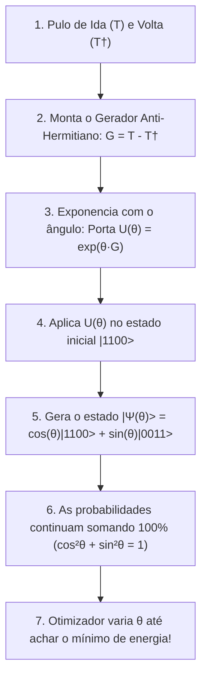

# Entendendo o UCCSD a Fundo: Theta, Operador G, Portas e Probabilidade

> **Para estudantes de Ciência da Computação:** Este guia responde com clareza matemática e computacional às 3 grandes dúvidas:
> 1. Onde entra o $\theta$ e como ele se conecta ao estado?
> 2. O que diabos é o $G$? Ele é uma porta? De onde ele vem?
> 3. Por que matrizes de portas têm a ver com a regra de probabilidade dos coeficientes ao quadrado ($|c|^2$)?

---

## 1. Onde entra o $\theta$? Como ele se conecta ao Estado?

Você tem toda razão: **o estado quântico é uma soma ponderada de kets com coeficientes antes deles**.

Para a molécula de $H_2$, o estado geral que queremos construir é uma mistura entre o estado inicial e o estado excitado:

$$|\Psi\rangle = c_1 |1100\rangle + c_2 |0011\rangle$$

A regra de ouro da mecânica quântica que você mencionou é:
$$\text{Probabilidade de medir } |1100\rangle = |c_1|^2$$
$$\text{Probabilidade de medir } |0011\rangle = |c_2|^2$$
$$\text{E a soma DEVE ser } |c_1|^2 + |c_2|^2 = 1.0 \quad (100\%)$$

### Onde entra o $\theta$?
Como garantimos que $|c_1|^2 + |c_2|^2 = 1$ para qualquer valor que o otimizador escolher?  
Usamos **seno e cosseno** de um ângulo $\theta$, porque da trigonometria sabemos que:
$$\cos^2(\theta) + \sin^2(\theta) = 1$$

Então definimos os coeficientes em função do ângulo $\theta$:
$$|\Psi(\theta)\rangle = \cos(\theta) |1100\rangle + \sin(\theta) |0011\rangle$$

* Se $\theta = 0$: $\cos(0) = 1$ e $\sin(0) = 0 \implies |\Psi\rangle = 1.0 |1100\rangle$ (100% no estado inicial de Hartree-Fock).
* Se $\theta = 0.1$: $\cos(0.1) \approx 0.995$ e $\sin(0.1) \approx 0.0998 \implies |\Psi\rangle = 0.995 |1100\rangle + 0.0998 |0011\rangle$.
  - Probabilidade de $|1100\rangle = 0.995^2 \approx 99\%$
  - Probabilidade de $|0011\rangle = 0.0998^2 \approx 1\%$
  - Soma: $99\% + 1\% = 100\%$.

> **Conclusão:** O $\theta$ é simplesmente o **ângulo** que controla a porcentagem de elétrons que pularam para o estado excitado!

---

## 2. O que é o $G$? Ele é uma Porta?

**Resposta direta:** Não, $G$ sozinho **NÃO** é uma porta.  
$G$ é o que chamamos de **"Gerador"** (a receita da transformação). A porta quântica real é a **exponencial de $G$ multiplicada por $\theta$**:

$$\text{Porta Quântica Real } U(\theta) = \exp(\theta \cdot G)$$

### Vamos ver isso em forma de Matriz (2D para simplificar):
Imagine um subespaço onde temos apenas dois estados: $|1100\rangle = \begin{bmatrix} 1 \\ 0 \end{bmatrix}$ e $|0011\rangle = \begin{bmatrix} 0 \\ 1 \end{bmatrix}$.

1. **O Operador de Ida $T$:** Ele só sabe pegar $|1100\rangle$ e transformar em $|0011\rangle$.
   $$T = \begin{bmatrix} 0 & 0 \\ 1 & 0 \end{bmatrix}$$
   Se você aplicar $T$ duas vezes, o elétron desaparece ($T^2 = 0$). Isso não é uma porta quântica reversível!

2. **O Operador de Volta $T^\dagger$:** Ele pega $|0011\rangle$ e traz de volta para $|1100\rangle$.
   $$T^\dagger = \begin{bmatrix} 0 & 1 \\ 0 & 0 \end{bmatrix}$$

3. **O Gerador $G = T - T^\dagger$:** É a matriz de ida e volta:
   $$G = \begin{bmatrix} 0 & 0 \\ 1 & 0 \end{bmatrix} - \begin{bmatrix} 0 & 1 \\ 0 & 0 \end{bmatrix} = \begin{bmatrix} 0 & -1 \\ 1 & 0 \end{bmatrix}$$
   Observe a propriedade especial dessa matriz: a sua transposta conjugada é o negativo dela ($G^\dagger = -G$). Isso é o que chamamos de matriz **Anti-Hermitiana**.

4. **A Porta Quântica $U(\theta) = \exp(\theta \cdot G)$:**
   Se calcularmos a exponencial da matriz $\theta \cdot G$ (usando a série de Taylor $e^M = I + M + \frac{M^2}{2!} + \dots$):
   $$\exp\left(\theta \begin{bmatrix} 0 & -1 \\ 1 & 0 \end{bmatrix}\right) = \begin{bmatrix} \cos(\theta) & -\sin(\theta) \\ \sin(\theta) & \cos(\theta) \end{bmatrix}$$

Olhe para essa matriz final: **ela é exatamente uma matriz de rotação 2D (uma porta quântica)!**

Quando aplicamos essa porta no nosso estado inicial $|1100\rangle = \begin{bmatrix} 1 \\ 0 \end{bmatrix}$:
$$\begin{bmatrix} \cos(\theta) & -\sin(\theta) \\ \sin(\theta) & \cos(\theta) \end{bmatrix} \begin{bmatrix} 1 \\ 0 \end{bmatrix} = \begin{bmatrix} \cos(\theta) \\ \sin(\theta) \end{bmatrix} = \cos(\theta)|1100\rangle + \sin(\theta)|0011\rangle$$

> **Em resumo:**
> - $G$ é a matriz de direção de rotação (como um eixo de giro).
> - $\theta$ é o quanto você gira em torno desse eixo.
> - $\exp(\theta G)$ é a porta quântica resultante que gira o estado!

---

## 3. Por que a propriedade de uma porta tem a ver com $|c|^2 = 100\%$?

Você disse: *"pra mim a probabilidade era o quadrado dos coeficientes antes dos kets, não?"*  
**E você está absolutamente coberta de razão!**

A ligação entre a porta e os coeficientes ao quadrado é a seguinte:

Em álgebra linear, para qualquer vetor $|\Psi\rangle = \begin{bmatrix} c_1 \\ c_2 \end{bmatrix}$, o comprimento (norma) ao quadrado desse vetor é:
$$\| |\Psi\rangle \|^2 = |c_1|^2 + |c_2|^2$$

Para que a física quântica funcione, o comprimento desse vetor no espaço complexo tem que ser **sempre exatamente $1$**.

Se você multiplicar o vetor por uma matriz qualquer $M$, o novo vetor será $|\Psi'\rangle = M |\Psi\rangle$.
A pergunta é: **Que tipo de matriz tem a propriedade mágica de NUNCA mudar o comprimento do vetor, não importa quantas vezes você a aplique?**

* Resposta: Uma matriz onde $U^\dagger U = I$ (chamada de **Matriz Unitária**).
* Matrizes Unitárias funcionam como **rotações rígidas no espaço**: se você gira um lápis de 10 cm, ele continua medindo 10 cm.
* E qual é o teorema matemático que cria matrizes unitárias?
  $$\text{Se } G \text{ é anti-hermitiano } (G = T - T^\dagger), \text{ então } U = \exp(\theta G) \text{ é GARANTIDAMENTE unitária!}$$

Portanto, exigir que a porta seja $\exp(\theta(T - T^\dagger))$ é o que **garante por construção** que a soma dos quadrados dos coeficientes $|c_1|^2 + |c_2|^2 + \dots$ nunca saia de $100\%$ durante o circuito!

---

## 4. O Quadro Geral Resumido

Ficou mais claro agora como o $\theta$, o $G$, as matrizes unitárias e a regra do $|c|^2$ se encaixam perfeitamente?
