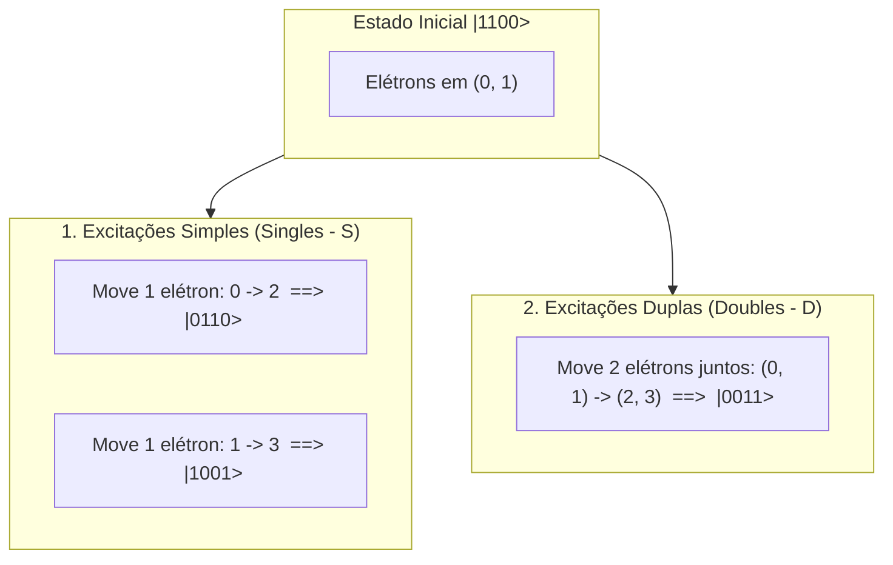
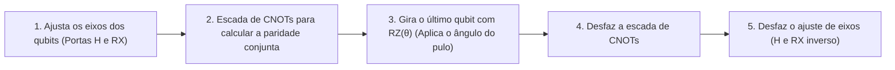

# UCCSD Descomplicado: Guia Visual e Intuitivo para Ciência da Computação

> **Objetivo:** Explicar o UCCSD e o VQE de forma 100% intuitiva, sem jargões desnecessários, usando analogias da computação (bits, arrays e otimização).

---

## 1. A Grande Ideia: O Jogo das Cadeiras dos Elétrons

Imagine que uma molécula é como uma sala com **cadeiras numeradas** onde moram os elétrons:

```text
Cadeiras Ocupadas (Baixa Energia)     Cadeiras Vazias (Alta Energia)
          [ 0 ]   [ 1 ]                         [ 2 ]   [ 3 ]
         (Elétron)(Elétron)                    (Vazio) (Vazio)
```

No computador quântico, representamos essas 4 cadeiras como uma cadeia de 4 bits:
* `1` = cadeira com elétron.
* `0` = cadeira vazia.

### O Estado Inicial (Hartree-Fock)
A aproximação inicial mais simples é colocar todos os elétrons nas cadeiras mais baixas:
$$\text{Estado Inicial} = |1\,1\,0\,0\rangle$$

---

## 2. O que é o UCCSD no fundo?

A química clássica finge que os elétrons ficam parados para sempre nas cadeiras `[0, 1]`.  
Mas na física real, os elétrons se repelem e gostam de **"pular"** para as cadeiras vazias `[2, 3]`.

O **UCCSD** (*Unitary Coupled Cluster Singles and Doubles*) é simplesmente um gerador de todas as formas possíveis de fazer esses pulos:



1. **Excitação Simples ($T_1$ / Singles):** Move **1 elétron** de uma cadeira ocupada para uma vazia.
2. **Excitação Dupla ($T_2$ / Doubles):** Move **2 elétrons** ao mesmo tempo de duas cadeiras ocupadas para duas vazias.

---

## 3. Traduzindo a Matemática e o Código para Computação

Aqui está a "tradução" do que cada símbolo matemático e cada linha de código realmente significa:

| Símbolo Matemático | O que significa na Computação | No Código Python (Ket) |
| :--- | :--- | :--- |
| $a_0$ | **Tira** o elétron da cadeira `0` (aniquilação) | `AnnihilateFermion(0)` |
| $a_2^\dagger$ | **Coloca** um elétron na cadeira `2` (criação) | `CreateFermion(2)` |
| $a_2^\dagger a_0$ | Pega o elétron de `0` e joga em `2` (o pulo!) | `CreateFermion(2) * AnnihilateFermion(0)` |
| $\theta$ (Theta) | O "botão de volume" de quanto esse pulo acontece | `params = [theta_1, theta_2, theta_3]` |
| $G = T - T^\dagger$ | Faz a ida menos a volta para manter $100\%$ de probabilidade | `FermionSentence({ida: 1.0, volta: -1.0})` |
| $A = i \cdot G$ | Multiplica por $i$ para transformar em números reais normais | `1j * mapped_hamiltonian` |

---

## 4. Por que precisamos da "Ida Menos a Volta" ($T - T^\dagger$)?

Em computadores clássicos, você pode criar uma variável com qualquer valor.  
Mas na Computação Quântica, a soma de todas as probabilidades do sistema tem que ser **exatamente 100% (1.0)** em todos os momentos. Você não pode "destruir" probabilidade.

* Se você só aplicasse o pulo de ida ($T$), a probabilidade total iria vazar e desconfigurar o circuito.
* Quando fazemos o pulo de ida **menos** o pulo de volta ($T - T^\dagger$), a matemática garante que a operação é **Unitária**.
* Uma operação unitária é como girar uma esfera no espaço: ela muda a posição, mas nunca muda o tamanho da esfera (conserva 100% da probabilidade).

---

## 5. Como o Circuito Quântico Executa Isso na Prática?

O computador quântico não tem uma porta chamada `PulaEletron()`. Ele só entende portas básicas como `CNOT`, `Hadamard (H)` e rotações `RZ`.

Então o nosso código decompõe cada pulo em uma receita de bolo física:



---

## 6. O Loop do VQE: Encontrando a Menor Energia

Pense no VQE como um algoritmo de otimização clássico (como um Gradiente Descendente ou Busca Local):

```text
[Início] θ = [0.0, 0.0, 0.0]  --> Estado |1100> (Hartree-Fock) --> Energia = -1.98 Ha
   │
   ├── Otimizador (SciPy): "E se aumentarmos θ_dupla para 0.05?"
   │   --> Mede no Ket: Energia caiu para -1.99 Ha! (Melhorou!)
   │
   ├── Otimizador (SciPy): "E se aumentarmos para 0.11?"
   │   --> Mede no Ket: Energia caiu para -2.0013 Ha! (Excelente!)
   │
   └── Otimizador (SciPy): "Qualquer outro valor agora aumenta a energia..."
       --> PAROU: Encontramos o Estado Fundamental da molécula!
```

---

## 7. Resumo Prático para Lembrar Sempre

1. **Estado Inicial:** Elétrons empilhados na base (`|1100>`).
2. **UCCSD:** Uma lista de instruções que permite aos elétrons pularem para posições livres (1 por 1 ou aos pares).
3. **Parâmetros $\theta$:** Controlam a intensidade de cada pulo em superposição.
4. **VQE:** O algoritmo clássico que fica girando esses botões $\theta$ até a energia calculada pelo Ket atingir o menor valor possível.
